# 🚀 OhMyPosh Atomic Enhanced

[](https://github.com/Nick2bad4u/OhMyPosh-Atomic-Enhanced) [](https://github.com/Nick2bad4u/OhMyPosh-Atomic-Enhanced/issues) [](https://opensource.org/licenses/UnLicense) [](https://ohmyposh.dev/)

This repository provides a custom theme configuration for [Oh My Posh](https://ohmyposh.dev/), a cross-platform prompt theming engine for shells like PowerShell, Bash, and Zsh. Inspired by the AtomicBit theme, this project aims to deliver a visually rich, highly informative, and developer-friendly prompt experience. It is designed for users who want a modern, customizable shell prompt with enhanced status indicators, dynamic segments, and consistent appearance across Windows, Linux, and macOS terminals.

Whether you're a developer or power user, this theme helps you work faster and smarter by making your shell prompt more informative and visually appealing.

<figure>
  
  <figcaption><strong>Windows Terminal</strong> showcasing the Atomic Enhanced Oh My Posh prompt with left/right blocks, git status, and dynamic battery/system info.</figcaption>
</figure>

<figure>
  
  <figcaption><strong>VS Code Integrated Terminal</strong> using the same theme, demonstrating consistent appearance across environments.</figcaption>
</figure>

## 🧩 How the OhMyPosh Custom Theme Works

See: [General Configuration](https://ohmyposh.dev/docs/configuration/general) • [Theme Files](https://ohmyposh.dev/docs/themes) • Segment Docs (example: [Git](https://ohmyposh.dev/docs/segments/scm/git))

> [NOTE] This theme is highly customizable--feel free to tweak colors and segments! 🚀

This theme is a highly customized configuration for [Oh My Posh](https://ohmyposh.dev/), designed to provide a visually rich, informative, and efficient prompt for your shell. It leverages advanced features of Oh My Posh, including segment styling, dynamic templates, mapped locations, and tooltips for various development environments.

### 🧱 Theme Structure

Docs: JSON Schema (section: [Validation](https://ohmyposh.dev/docs/configuration/general#json-schema-validation)) · [Block Config](https://ohmyposh.dev/docs/configuration/block) · [Segment Config](https://ohmyposh.dev/docs/configuration/segment)

- **Schema**: The theme uses the official Oh My Posh theme schema for validation and compatibility.
- **Accent Color**: Sets a primary accent color for visual consistency.
- **Blocks**: The prompt is divided into multiple blocks, each with its own alignment (left, right, or newline) and segments.

#### ◀️ Left-Aligned Prompt

Relevant segments: [shell](https://ohmyposh.dev/docs/segments/system/shell) · [root](https://ohmyposh.dev/docs/segments/system/root) · [path](https://ohmyposh.dev/docs/segments/system/path) · [git](https://ohmyposh.dev/docs/segments/scm/git) · [executiontime](https://ohmyposh.dev/docs/segments/system/executiontime) · [status](https://ohmyposh.dev/docs/segments/system/status)

Contains segments for:

- **Shell Info 🐚**: Displays shell name and version, with mapped names for common shells.
- **Root Status 🔐**: Highlights if running as administrator/root.
- **Path 📁**: Shows the current directory, with custom icons and mapped locations for quick recognition (e.g., "UW" for Uptime-Watcher repo, icons for Desktop/Documents/Downloads).
- **Git 🌿**: Shows branch, status, and upstream info, with color changes based on git state.
- **Execution Time ⏱️**: Displays how long the last command took to run.
- **Status ✅/❌**: Indicates success or error of the last command.

#### ▶️ Right-Aligned Prompt

Relevant segments: [sysinfo](https://ohmyposh.dev/docs/segments/system/sysinfo) · [os](https://ohmyposh.dev/docs/segments/system/os) · [time](https://ohmyposh.dev/docs/segments/system/time) · [weather](https://ohmyposh.dev/docs/segments/web/owm) · [battery](https://ohmyposh.dev/docs/segments/system/battery)

Contains segments for:

- **System Info 🧮**: CPU, memory, and disk usage, with dynamic coloring.
- **OS Info 🖥️**: Shows the operating system and WSL status.
- **Time 🕒**: Current date and time, with customizable format.
- **Weather ☀️**: Displays current temperature using OpenWeatherMap (OWM), with units and timeout settings.
- **Battery 🔋**: Shows battery status and state, with color changes for charging/discharging/full.

#### ➡️ Right Prompt (RPROMPT)

Relevant segments: [promptcounter](https://ohmyposh.dev/docs/configuration/templates) · [upgrade](https://ohmyposh.dev/docs/segments/system/upgrade) · [root](https://ohmyposh.dev/docs/segments/system/root)

Contains segments for:

- **Prompt Count #️⃣**: Shows the number of prompts in the session.
- **Upgrade Notice ⬆️**: Indicates if Oh My Posh can be upgraded.
- **Root Status ⚡**: Quick root indicator.

#### ⤵️ Newline Block

Relevant segments: [text](https://ohmyposh.dev/docs/segments/system/text) (decorative line) · [session](https://ohmyposh.dev/docs/segments/system/session) · [status](https://ohmyposh.dev/docs/segments/system/status)

Contains segments for:

- **Decorative Line ─**: Visual separator for prompt clarity.
- **Session Info 👤**: Shows username and SSH session status.
- **Status ✅/❌**: Indicates command status with icons.

### ✨ Key Features

Docs: [Templates](https://ohmyposh.dev/docs/configuration/templates) · [Mapped Locations](https://ohmyposh.dev/docs/segments/system/path#mapped-locations) · Caching (section removed: see [General Config](https://ohmyposh.dev/docs/configuration/general) for related settings) · Styles & Separators (see [General Config](https://ohmyposh.dev/docs/configuration/general)) · [Tooltips](https://ohmyposh.dev/docs/configuration/tooltips)

- **Dynamic Templates 🧬**: Many segments use Go template syntax to display context-aware information (e.g., git status, shell name, mapped locations).
- **Mapped Locations 🗺️**: Custom folder names/icons for frequently used paths, making navigation easier.
- **Segment Styling 💎**: Uses "diamond" and "powerline" styles for modern, visually appealing separators and backgrounds.
- **Caching ⚡**: Segments cache their data for performance, with customizable durations and strategies (e.g., session, folder).
- **Tooltips 💡**: Provides quick info for common tools (React, Python, Node, Java, Git, etc.) when detected in the current folder.
- **Status and Error Handling 🚦**: Segments change color and icons based on command success, errors, or git state.
- **Customization 🎯**: Nearly every aspect (colors, icons, templates, widths) can be adjusted to fit your workflow and preferences.

### 📦 Oh-My-Posh Installation

Docs: Installation: [Windows](https://ohmyposh.dev/docs/installation/windows) · [macOS](https://ohmyposh.dev/docs/installation/macos) · [Linux](https://ohmyposh.dev/docs/installation/linux) · [Fonts](https://ohmyposh.dev/docs/installation/fonts) · [Customize](https://ohmyposh.dev/docs/installation/customize)

1. [Windows](https://ohmyposh.dev/docs/installation/windows)
2. [Linux](https://ohmyposh.dev/docs/installation/linux)
3. [MacOS](https://ohmyposh.dev/docs/installation/macos)

### 🛠️ How to Use

1. **Quick Start (from GitHub URL):** You can use the theme directly from the GitHub repository without downloading it:

```pwsh
oh-my-posh init pwsh --config "https://raw.githubusercontent.com/Nick2bad4u/OhMyPosh-Atomic-Enhanced/main/OhMyPosh-Atomic-Custom.json" | Invoke-Expression
```

2. **Local Setup:** Copy the theme JSON (`OhMyPosh-Atomic-Custom.json`) to your system. Set your shell to use this theme with Oh My Posh:

```pwsh
oh-my-posh init pwsh --config "<path-to>/OhMyPosh-Atomic-Custom.json" | Invoke-Expression
```

Customize mapped locations, icons, and colors as needed in the JSON file.

### 🧪 Advanced Customization

Docs: [Segment Config](https://ohmyposh.dev/docs/configuration/segment) · [Templates Guide](https://ohmyposh.dev/docs/configuration/templates) · [Palette & Colors](https://ohmyposh.dev/docs/configuration/colors) · [Tooltips](https://ohmyposh.dev/docs/configuration/tooltips)

- **Segment Properties**: Each segment type (shell, path, git, etc.) has its own properties for fine-tuning behavior and appearance.
- **Templates**: Use Go template expressions to display dynamic info (see [Oh My Posh docs](https://ohmyposh.dev/docs/configuration/templates)).
- **Tooltips**: Add or modify tooltips for your favorite tools and languages.

For more details, see the [Oh My Posh documentation](https://ohmyposh.dev/docs/).

## 📚 Documentation

For comprehensive guides, configuration options, and troubleshooting, refer to the official Oh My Posh documentation at [https://ohmyposh.dev/docs](https://ohmyposh.dev/docs).

## 🎨 Palette & Color Groups

The theme centralizes all colors in a `palette` so segments and templates stay consistent and easy to tweak. Colors are grouped by functional intent rather than pure hue. Use `p:<key>` anywhere a color is accepted (foreground/background, templates like `<p:key>` or `<p:fg,p:bg>`).

| Group                                                  | Key                                                    | Description                                                   |
| ------------------------------------------------------ | ------------------------------------------------------ | ------------------------------------------------------------- |
| Core / Base                                            | `accent`                                               | Primary accent and prompt line markers.                       |
| `black`, `white`                                       | Base monochrome anchors.                               |
| Blues (Shell / Time / Info)                            | `blue_primary`                                         | Shell segment background & transient prompt color.            |
| `blue_time`                                            | Time and connection segments.                          |
| `blue_tooltip`                                         | Tooltip foreground accents.                            |
| `windows_blue`                                         | Windows registry/version segment.                      |
| `python_blue`                                          | Python runtime background.                             |
| `navy_text`                                            | Dark readable foreground on bright yellows.            |
| Purples (Session / Branch State / Execution)           | `purple_session`                                       | Session username & debug banners.                             |
| `purple_ahead`                                         | Git ahead/behind highlighting.                         |
| `purple_exec`                                          | Execution time segment.                                |
| `violet_project`                                       | Project/workspace segment.                             |
| Reds & Pinks (Errors / Alerts)                         | `red_alert`                                            | Root/admin & error emphasis.                                  |
| `red_deleted`                                          | Git deleted files counter.                             |
| `maroon_error`                                         | Error status background.                               |
| `pink_error_line`                                      | Error line symbol in multiline prompts.                |
| `pink_status_fail`                                     | Failure state in status templates.                     |
| Oranges (Path / Battery / Java / General Warm Accents) | `orange`                                               | Path and tooltip path segment.                                |
| `orange_unmerged`                                      | Git unmerged count.                                    |
| `orange_battery`                                       | Battery base color.                                    |
| `java_orange`                                          | Java version tooltip.                                  |
| Yellows (Attention / Status / Update)                  | `yellow_bright`                                        | Git base background & root foreground; high-attention blocks. |
| `yellow_modified`                                      | Git modified files.                                    |
| `yellow_git_changed`                                   | Git working/staging changed blend.                     |
| `yellow_update`                                        | Upgrade notification segment.                          |
| `yellow_root_alt`                                      | Alt root indicator (rprompt).                          |
| `yellow_discharging`                                   | Battery discharging state.                             |
| Greens (Success / Health / Battery / Helpers)          | `green_added`                                          | Git added files.                                              |
| `green_ahead`                                          | Combined ahead/behind git state.                       |
| `green_full`                                           | Battery full state.                                    |
| `green_success`                                        | Command success background template.                   |
| `green_help`                                           | Help / generic info text badge.                        |
| `green_valid_line`                                     | Valid line symbol.                                     |
| `green_charging`                                       | Battery charging state.                                |
| Cyans                                                  | `cyan_renamed`                                         | Git renamed files count.                                      |
| `cyan_status_fg`                                       | Status indicator foreground (multiline tail).          |
| Magenta                                                | `magenta_copied`                                       | Git copied files count.                                       |
| Weather / Misc                                         | `pink_weather`                                         | Weather segment background.                                   |
| Grays (Neutral/UI Framing)                             | `gray_os`                                              | OS segment background.                                        |
| `gray_os_fg`                                           | OS / neutral text foreground & reused for subtle text. |
| `gray_untracked`                                       | Git untracked file count.                              |
| `gray_prompt_count_bg`                                 | Prompt count background.                               |
| `gray_prompt_count_fg`                                 | Prompt count foreground.                               |
| `gray_path_fg`                                         | Path tooltip foreground & neutral dark text.           |
| Language / Tool Specific                               | `node_green`                                           | Node.js / package manager tooltip background.                 |
| `python_yellow`                                        | Python secondary (logo yellow).                        |

### Using Palette Entries

Examples:

```jsonc
"foreground": "p:accent"
"background": "p:blue_primary"
"template": "<p:green_success> OK </><p:red_alert> ERR </>"
"background_templates": ["{{ if .Error }}p:maroon_error{{ end }}"]
```

This structure lets you retheme quickly: adjust a palette value once and every segment using it updates automatically.

The included [`validate-palette.ps1`](./validate-palette.ps1) script (located in the root of this repository) checks that every `p:<key>` reference in the config matches a palette entry. It also reports any unused palette keys.

> [!WARNING] Always run the validation script after changes to avoid palette mismatches! ⚠️

**Note:** Requires PowerShell 7 or later. No external modules are needed; the script uses only built-in PowerShell features.

**Note:** Run the following command from the repository root to ensure correct results.

Run it (from repo root):

```pwsh
pwsh ./validate-palette.ps1
```

Exit codes:

- `0` clean (no missing/unused)
- `2` missing references
- `3` only unused keys

After making changes to the palette or theme configuration, run this script to ensure all palette references are valid and unused keys are reported--helping keep your configuration clean and error-free.

## 🎨 Theme Gallery

All themes are available in **16 unique color palettes**. Choose the one that fits your style!

<style>
.theme-preview {
  transition: transform 0.3s ease, box-shadow 0.3s ease;
  cursor: pointer;
  position: relative;
  width: 100%;
  border-radius: 8px;
}
.theme-preview:hover {
  transform: scale(1.3);
  box-shadow: 0 15px 40px rgba(0,0,0,0.6);
  z-index: 9999;
  position: relative;
}
td {
  overflow: visible !important;
  position: relative;
}
table {
  overflow: visible !important;
}
/* Fullscreen modal */
.modal {
  display: none;
  position: fixed;
  z-index: 99999;
  left: 0;
  top: 0;
  width: 100%;
  height: 100%;
  background-color: rgba(0,0,0,0.95);
  align-items: center;
  justify-content: center;
}
.modal-content {
  display: block;
  width: 90%;
  max-width: 1200px;
  animation: zoom 0.3s;
}
@keyframes zoom {
  from {transform: scale(0)}
  to {transform: scale(1)}
}
.close {
  position: absolute;
  top: 15px;
  right: 35px;
  color: #f1f1f1;
  font-size: 40px;
  font-weight: bold;
  transition: 0.3s;
  cursor: pointer;
  z-index: 100000;
}
.close:hover,
.close:focus {
  color: #bbb;
}
</style>

<div id="imageModal" class="modal" onclick="this.style.display='none'">
  <span class="close">&times;</span>
  
</div>

<script>
// Add click event to all theme previews
document.addEventListener('DOMContentLoaded', function() {
  const images = document.querySelectorAll('.theme-preview');
  const modal = document.getElementById('imageModal');
  const modalImg = document.getElementById('modalImage');

  images.forEach(img => {
    img.onclick = function() {
      modal.style.display = 'flex';
      modalImg.src = this.src;
    };
  });

  // Close on escape key
  document.addEventListener('keydown', function(e) {
    if (e.key === 'Escape' && modal.style.display === 'flex') {
      modal.style.display = 'none';
    }
  });
});
</script>

### 📑 Table of Contents

#### 🚀 [OhMyPosh Atomic Custom Variants](#ohmyposh-atomic-custom-variants)
- [Original](#atomic-original) • [Nord Frost](#atomic-nordfrost) • [Gruvbox Dark](#atomic-gruvboxdark) • [Dracula Night](#atomic-draculanight)
- [Tokyo Night](#atomic-tokyonight) • [Monokai Pro](#atomic-monokaipro) • [Solarized Dark](#atomic-solarizeddark) • [Catppuccin Mocha](#atomic-catppuccinmocha)
- [Forest Ember](#atomic-forestember) • [Pink Paradise](#atomic-pinkparadise) 💗 • [Purple Reign](#atomic-purplereign) 👑 • [Red Alert](#atomic-redalert) 🔥
- [Blue Ocean](#atomic-blueocean) 🌊 • [Green Matrix](#atomic-greenmatrix) 💚 • [Amber Sunset](#atomic-ambersunset) 🌅 • [Teal Cyan](#atomic-tealcyan) ⚡

#### ✨ [1_shell-Enhanced Variants](#1_shell-enhanced-variants)
- [Original](#shell-original) • [Nord Frost](#shell-nordfrost) • [Gruvbox Dark](#shell-gruvboxdark) • [Dracula Night](#shell-draculanight)
- [Tokyo Night](#shell-tokyonight) • [Monokai Pro](#shell-monokaipro) • [Solarized Dark](#shell-solarizeddark) • [Catppuccin Mocha](#shell-catppuccinmocha)
- [Forest Ember](#shell-forestember) • [Pink Paradise](#shell-pinkparadise) 💗 • [Purple Reign](#shell-purplereign) 👑 • [Red Alert](#shell-redalert) 🔥
- [Blue Ocean](#shell-blueocean) 🌊 • [Green Matrix](#shell-greenmatrix) 💚 • [Amber Sunset](#shell-ambersunset) 🌅 • [Teal Cyan](#shell-tealcyan) ⚡

---

### 🚀 OhMyPosh Atomic Custom Variants

<table>
<tr>
<td align="center" width="50%" id="atomic-ambersunset">
<h4>Amber Sunset 🌅</h4>

<sub>Warm ambers, oranges, and golds - sunset palette</sub>
</td>
<td align="center" width="50%" id="atomic-blueocean">
<h4>Blue Ocean 🌊</h4>

<sub>Deep ocean blues and aquas - calm and serene</sub>
</td>
</tr>
<tr>
<td align="center" width="50%" id="atomic-catppuccinmocha">
<h4>Catppuccin Mocha</h4>
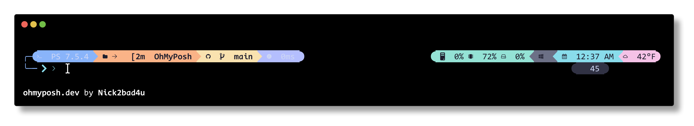
<sub>Soothing pastel colors with a cozy coffee shop aesthetic</sub>
</td>
<td align="center" width="50%" id="atomic-draculanight">
<h4>Dracula Night</h4>

<sub>Dark and mysterious with vibrant purple and pink highlights</sub>
</td>
</tr>
<tr>
<td align="center" width="50%" id="atomic-forestember">
<h4>Forest Ember</h4>

<sub>Deep forest greens with warm amber accents</sub>
</td>
<td align="center" width="50%" id="atomic-greenmatrix">
<h4>Green Matrix 💚</h4>

<sub>Matrix-inspired greens - cyberpunk terminal vibes</sub>
</td>
</tr>
<tr>
<td align="center" width="50%" id="atomic-gruvboxdark">
<h4>Gruvbox Dark</h4>
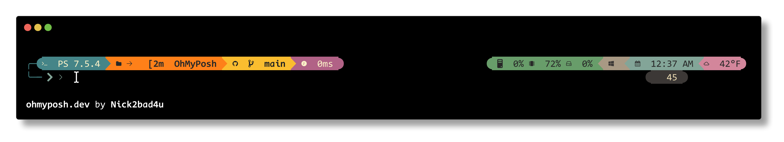
<sub>Warm retro colors with earthy tones - easy on the eyes</sub>
</td>
<td align="center" width="50%" id="atomic-monokaipro">
<h4>Monokai Pro</h4>

<sub>Classic Monokai with vibrant neon colors on dark background</sub>
</td>
</tr>
<tr>
<td align="center" width="50%" id="atomic-nordfrost">
<h4>Nord Frost</h4>
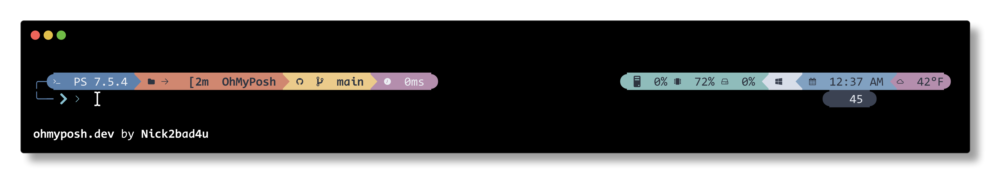
<sub>Arctic-inspired cool tones - calm and professional</sub>
</td>
<td align="center" width="50%" id="atomic-original">
<h4>Original</h4>
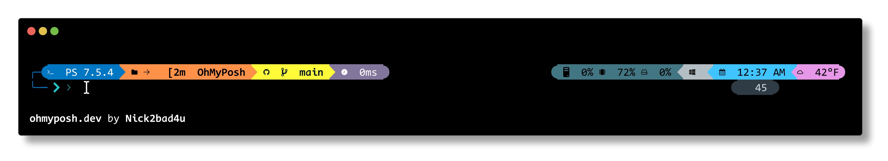
<sub>Your current bright, tech-focused palette with cyan accents</sub>
</td>
</tr>
<tr>
<td align="center" width="50%" id="atomic-pinkparadise">
<h4>Pink Paradise 💗</h4>
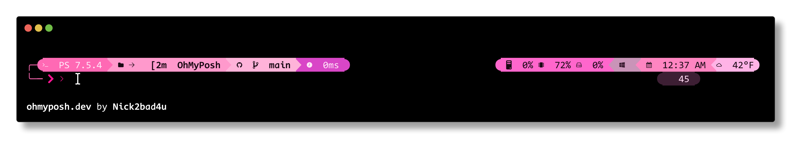
<sub>Vibrant pink and magenta themed palette - bold and feminine</sub>
</td>
<td align="center" width="50%" id="atomic-purplereign">
<h4>Purple Reign 👑</h4>
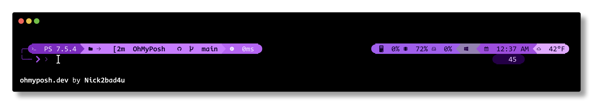
<sub>Deep purples and violets - royal and mysterious</sub>
</td>
</tr>
<tr>
<td align="center" width="50%" id="atomic-redalert">
<h4>Red Alert 🔥</h4>

<sub>Fiery reds and oranges - bold and energetic</sub>
</td>
<td align="center" width="50%" id="atomic-solarizeddark">
<h4>Solarized Dark</h4>

<sub>Scientifically designed palette for reduced eye strain</sub>
</td>
</tr>
<tr>
<td align="center" width="50%" id="atomic-tealcyan">
<h4>Teal Cyan ⚡</h4>

<sub>Vibrant teals and cyans - electric and modern</sub>
</td>
<td align="center" width="50%" id="atomic-tokyonight">
<h4>Tokyo Night</h4>

<sub>Modern Japanese night city vibes with neon blues and purples</sub>
</td>
</tr>
</table>

---

### ✨ 1_shell-Enhanced Variants

<table>
<tr>
<td align="center" width="50%" id="shell-ambersunset">
<h4>Amber Sunset 🌅</h4>
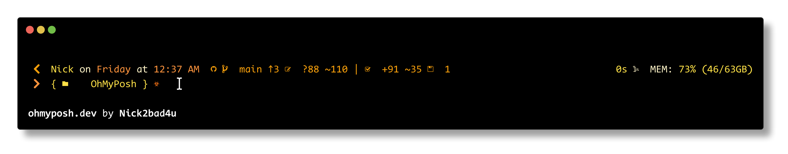
<sub>Warm ambers, oranges, and golds - sunset palette</sub>
</td>
<td align="center" width="50%" id="shell-blueocean">
<h4>Blue Ocean 🌊</h4>

<sub>Deep ocean blues and aquas - calm and serene</sub>
</td>
</tr>
<tr>
<td align="center" width="50%" id="shell-catppuccinmocha">
<h4>Catppuccin Mocha</h4>

<sub>Soothing pastel colors with a cozy coffee shop aesthetic</sub>
</td>
<td align="center" width="50%" id="shell-draculanight">
<h4>Dracula Night</h4>

<sub>Dark and mysterious with vibrant purple and pink highlights</sub>
</td>
</tr>
<tr>
<td align="center" width="50%" id="shell-forestember">
<h4>Forest Ember</h4>

<sub>Deep forest greens with warm amber accents</sub>
</td>
<td align="center" width="50%" id="shell-greenmatrix">
<h4>Green Matrix 💚</h4>

<sub>Matrix-inspired greens - cyberpunk terminal vibes</sub>
</td>
</tr>
<tr>
<td align="center" width="50%" id="shell-gruvboxdark">
<h4>Gruvbox Dark</h4>
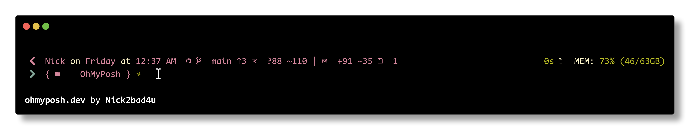
<sub>Warm retro colors with earthy tones - easy on the eyes</sub>
</td>
<td align="center" width="50%" id="shell-monokaipro">
<h4>Monokai Pro</h4>

<sub>Classic Monokai with vibrant neon colors on dark background</sub>
</td>
</tr>
<tr>
<td align="center" width="50%" id="shell-nordfrost">
<h4>Nord Frost</h4>

<sub>Arctic-inspired cool tones - calm and professional</sub>
</td>
<td align="center" width="50%" id="shell-original">
<h4>Original</h4>
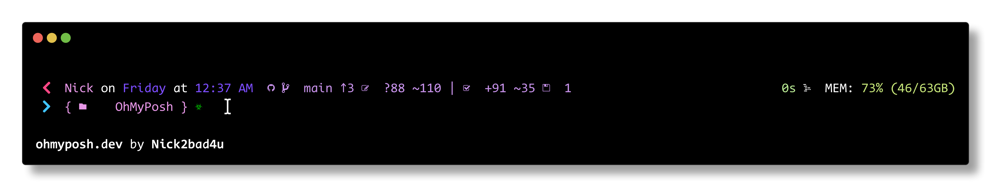
<sub>Your current bright, tech-focused palette with cyan accents</sub>
</td>
</tr>
<tr>
<td align="center" width="50%" id="shell-pinkparadise">
<h4>Pink Paradise 💗</h4>
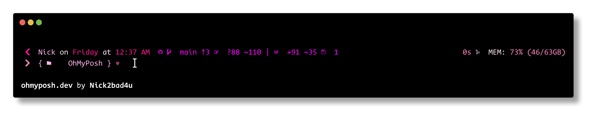
<sub>Vibrant pink and magenta themed palette - bold and feminine</sub>
</td>
<td align="center" width="50%" id="shell-purplereign">
<h4>Purple Reign 👑</h4>
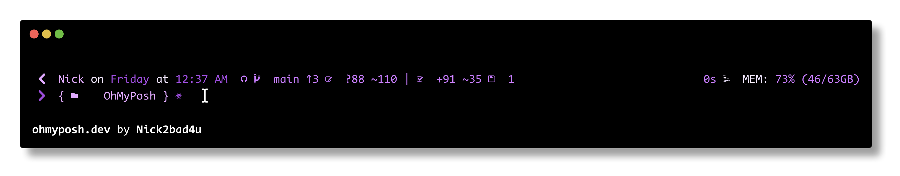
<sub>Deep purples and violets - royal and mysterious</sub>
</td>
</tr>
<tr>
<td align="center" width="50%" id="shell-redalert">
<h4>Red Alert 🔥</h4>
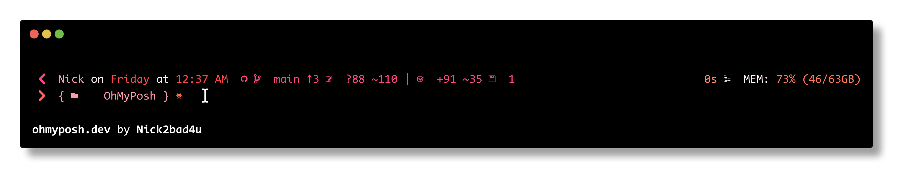
<sub>Fiery reds and oranges - bold and energetic</sub>
</td>
<td align="center" width="50%" id="shell-solarizeddark">
<h4>Solarized Dark</h4>
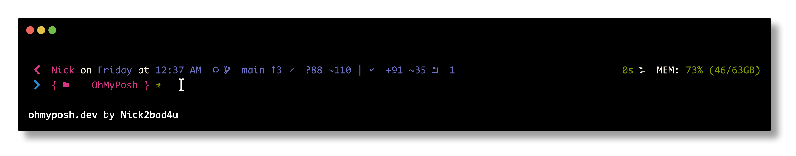
<sub>Scientifically designed palette for reduced eye strain</sub>
</td>
</tr>
<tr>
<td align="center" width="50%" id="shell-tealcyan">
<h4>Teal Cyan ⚡</h4>

<sub>Vibrant teals and cyans - electric and modern</sub>
</td>
<td align="center" width="50%" id="shell-tokyonight">
<h4>Tokyo Night</h4>

<sub>Modern Japanese night city vibes with neon blues and purples</sub>
</td>
</tr>
</table>

---

### 🎯 Quick Install

To use any theme, copy the command for your preferred variant:

```pwsh
# Replace <THEME_FILE> with the desired theme file name
oh-my-posh init pwsh --config "https://raw.githubusercontent.com/Nick2bad4u/OhMyPosh-Atomic-Enhanced/main/<THEME_FILE>" | Invoke-Expression
```

**Example:**
```pwsh
# Install Tokyo Night variant of Atomic Custom
oh-my-posh init pwsh --config "https://raw.githubusercontent.com/Nick2bad4u/OhMyPosh-Atomic-Enhanced/main/OhMyPosh-Atomic-Custom.TokyoNight.json" | Invoke-Expression
```

---


